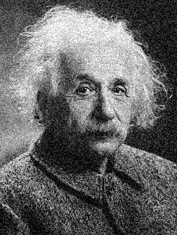

# NLA - Challenge 1

**Goal**: apply image filters and find the approximate solution of linear system to process a greyscale image.

**Data**: download the file [einstein.jpg](https://commons.wikimedia.org/wiki/File:Albert_Einstein_Head.jpg)
([256px][1])
and move it to your working directory.

**Tasks**:
1. Load the image as an Eigen matrix with size $m \times n$. 
   Each entry in the matrix corresponds to a pixel on the screen and takes a value somewhere 
   between 0 (black) and 255 (white). Report the size of the matrix.
   
   Answer: $341 \times 256$ ($rows \times cols$).

2. Introduce a noise signal into the loaded image by adding random fluctuations of color ranging 
   between $[-50, 50]$ to each pixel. Export the resulting image in `.png` and upload it.

   Answer: see the figure [noise.png](resources/noise.png).

   

3. Reshape the original and noisy images as vectors $v$ and $w$, respectively. 
   Verify that each vector has $m \: n$ components. Report here the Euclidean norm of $v$.

   Answer: $35576.621650$

4. Write the convolution operation corresponding to the smoothing kernel $H_{av2}$ as a matrix vector multiplication 
   between a matrix $A_{1}$ having size $mn \times mn$ and the image vector.

   Report the number of non-zero entries in $A_{1}$.

   Answer: $782086$

```math
 H_{av2} = \dfrac{1}{9}\begin{bmatrix}
     1 & 1 & 1 \\
     1 & 1 & 1 \\
     1 & 1 & 1
 \end{bmatrix}
```

5. Apply the previous smoothing filter to the noisy image by performing the matrix vector multiplication $A_{1}w$.
   Export the resulting image.

   Answer: see the figure [smoothing.png](resources/smoothing.png).

   

6. Write the convolution operation corresponding to the sharpening kernel $H_{sh2}$ as a matrix vector multiplication
   by a matrix $A_{2}$ having size $mn \times mn$. Report the number of non-zero entries in $A_{2}$.
   Is $A_{2}$ symmetric?

   Answer: 435286, is $A_{2}$ symmetric? false.

```math
 H_{sh2} = \dfrac{1}{9}\begin{bmatrix}
     0 & -3 & 0 \\
     -1 & 9 & -3 \\
     0 & -1 & 0
 \end{bmatrix}
```

7. Apply the previous sharpening filter to the original image by performing the matrix vector multiplication $A_{2}v$.
   Export the resulting image.

   Answer: see the figure [sharpening.png](resources/sharpening.png).

   

8. Export the Eigen matrix $A_{2}$ and vector $w$ in the `.mtx` format. 
   Using a suitable iterative solver and preconditioner technique available in the [LIS library](https://www.mankier.com/3/lis) 
   compute the approximate solution to the linear system $A_{2}x = w$ prescribing a tolerance of $10^{-9}$. 
   Report here the iteration count and the final residual.

   Answer: number of iterations $7$, number of final residual $\approx 6.227944e\text{-}12$.

9. Import the previous approximate solution vector $x$ in Eigen and then convert it into a .png image.
   Upload the resulting file here.

   Answer: see the figure [solution.png](resources/solution.png).

   

10. Write the convolution operation corresponding to the detection kernel $H_{lap}$ as a matrix vector multiplication 
    by a matrix $A_{3}$ having size $mn \times mn$. Is matrix $A_{3}$ symmetric?

    Answer: yes.

```math
 H_{lap} = \begin{bmatrix}
     0 & -1 & 0 \\
     -1 & 4 & -1 \\
     0 & -1 & 0
 \end{bmatrix}
```

[1]: https://upload.wikimedia.org/wikipedia/commons/thumb/d/d3/Albert_Einstein_Head.jpg/256px-Albert_Einstein_Head.jpg?20141125195928=&download=
