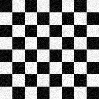

# NLA - Challenge 2

**Goal**: apply the singular value decomposition to image compression and noise reduction.

**Data**: download the file [einstein.jpg][1] and move it to your working directory.

**Tasks**:
1. Load the image as an Eigen matrix with size $m \times n$.
   Each entry in the matrix corresponds to a pixel on the screen and takes a value somewhere between 0 
   (black) and 255 (white).
   Compute the matrix product $A^{T}A$ and report the Euclidean norm of $A^{T}A$.
   
   Answer: $1050410679.542489$
2. Solve the eigenvalue problem $A^{T}Ax = \lambda x$ using the proper solver provided by the Eigen library.
   Report the two largest computed singular values of A.

   Answer: $1045817611.425505$ (largest), $90689465.396182$ (second largest)
3. Export matrix $A^{T}A$ in the matrix market format and move it to the `lis-2.1.6/test` folder.
   Using the proper iterative solver available in the LIS library compute the largest eigenvalue of $A^{T}A$
   up to a tolerance of $10^{-8}$. Report the computed eigenvalue. 
   Is the result in agreement with the one obtained in the previous point?

   Answer: yes, the value obtained is $1.045818e+09$.
4. Find a shift $\mu \in \mathbb{R}$ yielding an acceleration of the previous eigensolver.
   Report $\mu$ and the number of iterations required to achieve a tolerance of $10^{-8}$.

   Answer: $\mu = 4.244525\text{e+}07$ and $7$ iterations.
5. Using the SVD module of the Eigen library, perform a singular value decomposition of the
   matrix $A$. Report the Euclidean norm of the diagonal matrix $\Sigma$ of the singular values.

   Answer: $35576.621650$
6. Compute the matrices $C$ and $D$ assuming $k = 40$ and $k = 80$.
   Report the number of nonzero entries in the matrices $C$ and $D$.
   
   The truncated SVD considering the first $k$ terms, with $k < r$ is the best approximation of the matrix $A$
   among the matrices of the rank at most $k$ in the sense of Frobenius norm.
   This can be used for image compression as follows: instead of storing the whole $m \times n$ matrix $A$,
   we can instead store the $m \times k$ and $n \times k$ matrices
   $C = [\mathbf{u}_{1} \: \mathbf{u}_{2} \: \dots \: \mathbf{u}_{k}]$,
   $D = [\sigma_{1}\mathbf{v}_{1} \: \sigma_{2}\mathbf{v}_{2} \: \dots \: \sigma_{r}\mathbf{v}_{k}]$.
   If $k$ is much smaller than $p$, then storing $C$ and $D$ will take much less space than storing the full matrix $A$.
   The compressed image can be simply computed as $\tilde{A} = CD^{T}$.

   Answer: $C$ nnz = $13640$ and $D$ nnz = $20480$
8. Using `Eigen` create a black and white checkerboard image with height and width equal to 200 pixels.
   Report the Euclidean norm of the matrix corresponding to the image.

   Answer: $36062.445841$
9. Introduce a noise into the checkerboard image by adding random fluctuations 
   of color ranging between $[-50, 50]$ to each pixel.
   Export the resulting image in `.png` and upload it.

   Answer: see the figure [noise.png](resources/noise.png).
   
   

[1]: https://upload.wikimedia.org/wikipedia/commons/thumb/d/d3/Albert_Einstein_Head.jpg/256px-Albert_Einstein_Head.jpg?20141125195928=&download=
